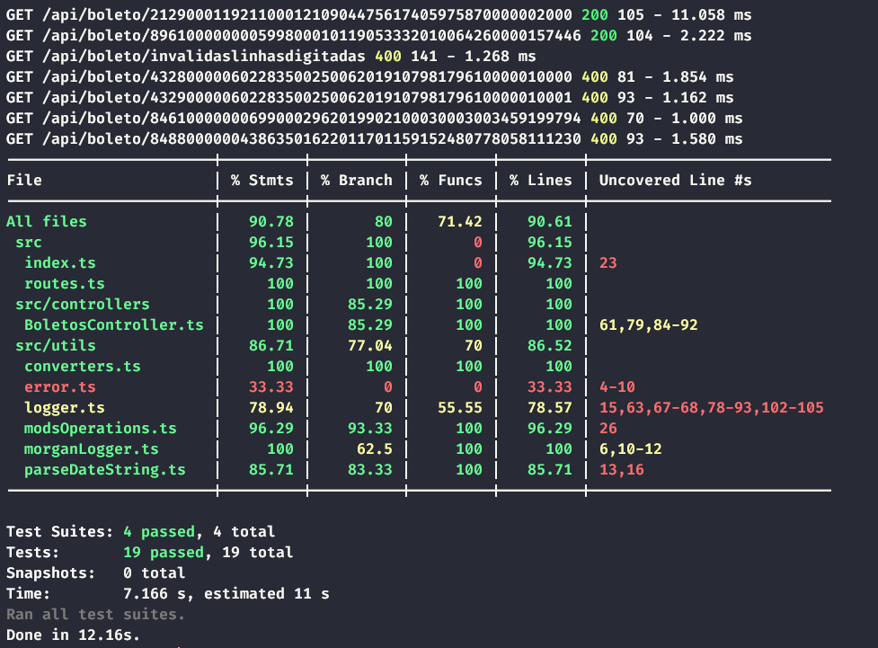

# API de validação de boletos
API feita em [Nodejs](https://nodejs.org) utilizando [TypeScript](https://www.typescriptlang.org) para validação de boletos do tipo título (cobrança) e convênio (arrecadação).

O desenvolvimento da API foi baseada nas especificações do [Banco do Brasil](https://www.bb.com.br/docs/pub/emp/empl/dwn/Doc5175Bloqueto.pdf) para a realização do boleto do tipo cobrança e com base nas especificações do [Febraban](https://portal.febraban.org.br/pagina/3166/33/pt-br/layour-arrecadacao) para realização do boleto do tipo arrecadação.

## Conceitos aplicados
Este projeto foi feito seguindo a prática de TDD (Test Driven Development) onde se trata de realizar os testes unitários para implementação de funcionalidades e logo após realizar o refatoramento de código. 

Leia mais no artigo da [DEV Media](https://www.devmedia.com.br/test-driven-development-tdd-simples-e-pratico/18533).

## Coverage de testes
Imagem com o total de coverage de testes.


## Como rodar o projeto?
Primeiro será necessário baixar as dependências com o gerenciador de pacotes de sua preferência
```bash
npm install
# OU
yarn add
```
Logo após você pode rodar o ambiente de desenvolvimento
```bash
npm run dev
# OU
yarn dev
```
Ou então você pode simular um ambiente de produção
```bash
npm run build && npm start
# OU
yarn build && yarn start
```
Caso queira rodar os testes
```bash
npm run test
# OU
yarn test
```